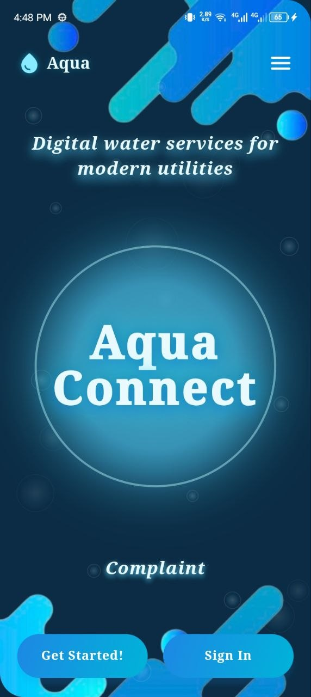
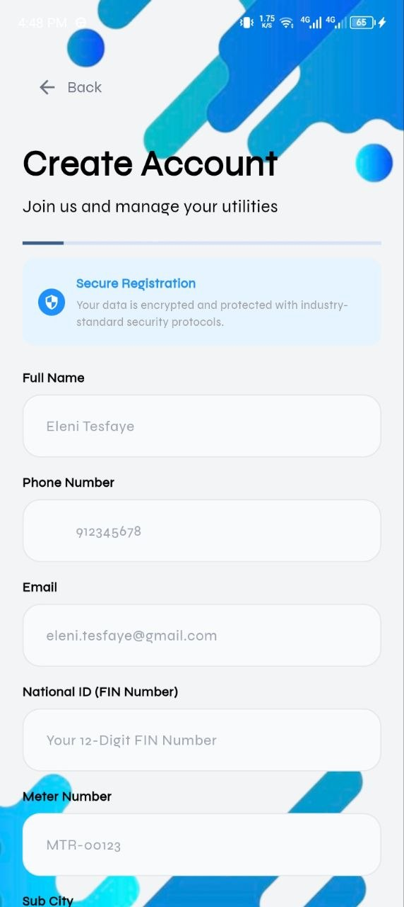
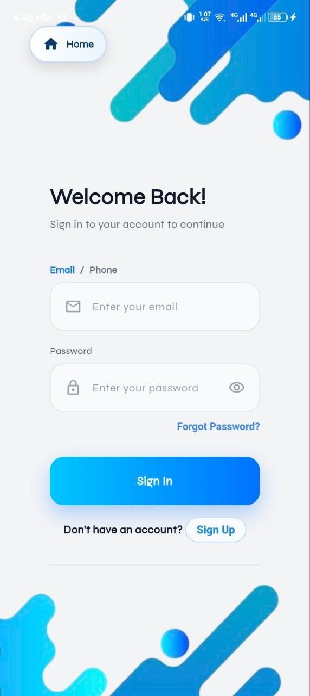
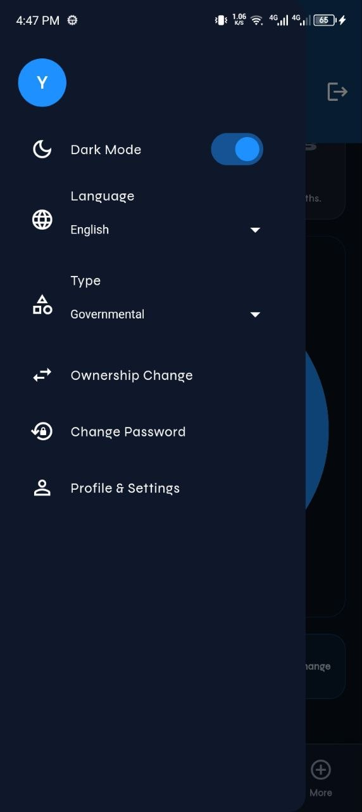
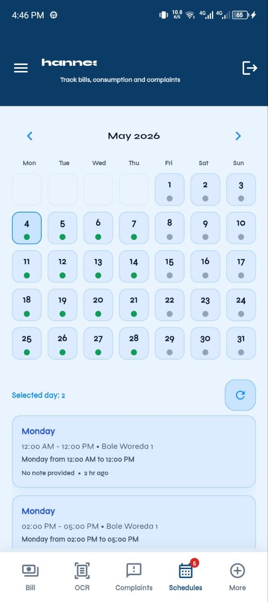
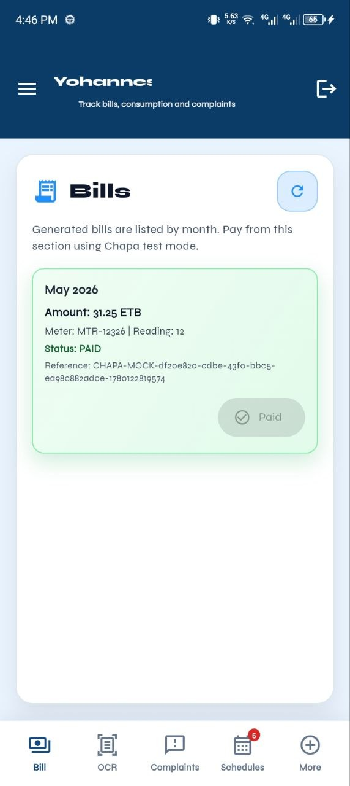
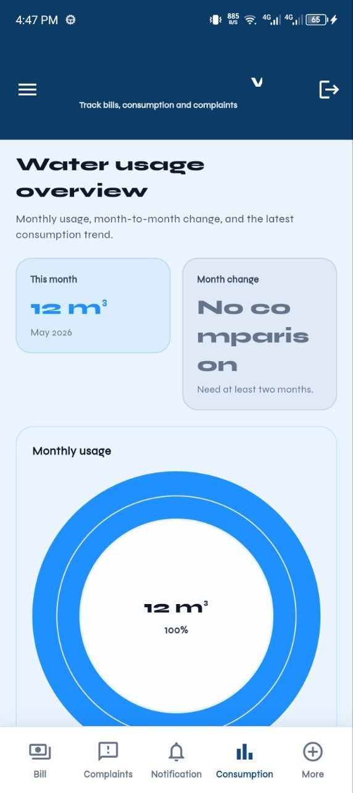
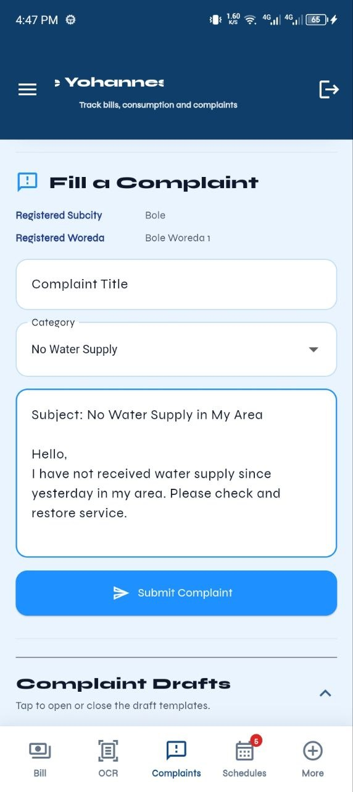
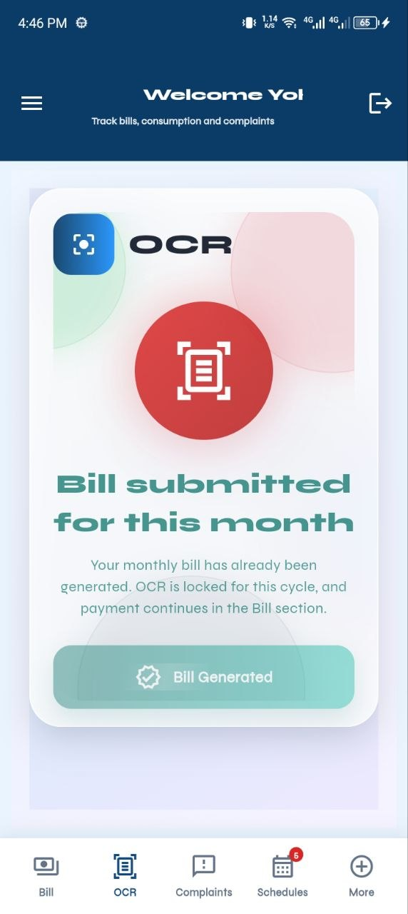
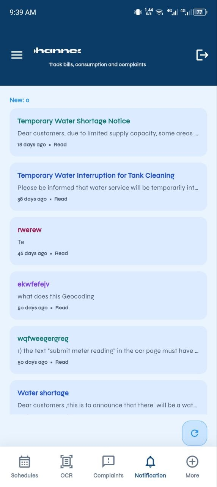

# AquaConnect — City Water Management System

> A unified platform for city water billing, administration, and mobile access.

## Overview

AquaConnect is a comprehensive water utility management platform designed for city and municipal water service providers. The system consists of:

- **Admin Web Portal** built with Next.js for utility staff and administrators.
- **Backend API** built with Node.js, Express, and Prisma ORM.
- **Mobile Application** built with Flutter for customers and field personnel.

The platform streamlines customer management, billing operations, water consumption tracking, authentication, reporting, and administrative workflows.

---


## Screenshots

<p align="center">
  
  
  
  
</p>

<p align="center">
  
  
  
  
</p>

<p align="center">
  
  
</p>

---

## Key Features

### Administration

- User and role management
- Service area/location management
- Customer account administration
- Administrative dashboard and reporting

### Billing System

- Water billing generation
- Payment tracking and history
- Outstanding balance monitoring
- Invoice and billing record management

### Authentication & Security

- JWT-based authentication
- Refresh token support
- OTP verification via email
- Role-based access control

### Mobile Access

- Customer account access
- Billing information viewing
- Water account monitoring
- Mobile-friendly user experience

### Backend Services

- RESTful API architecture
- Prisma ORM integration
- PostgreSQL database support
- Email notification services
- Secure authentication flows

---

## Repository Structure

```text
.
├── updated backend/
│   ├── prisma/
│   ├── src/
│   └── .env.example
│
├── aquaconnect-admin-main/
│   ├── src/
│   ├── public/
│   └── .env.example
│
├── flutter_frontend/
│   ├── lib/
│   ├── android/
│   ├── ios/
│   └── .env.example
│
└── screenshots/
    ├── photo_1_2026-05-21_16-54-49.jpg
    ├── ...
    └── photo_10_2026-05-21_16-54-50.jpg
```

---

## Technology Stack

### Backend

- Node.js
- Express.js
- Prisma ORM
- PostgreSQL
- JWT Authentication
- Nodemailer

### Frontend (Admin Portal)

- Next.js
- React
- TypeScript / JavaScript
- Tailwind CSS

### Mobile Application

- Flutter
- Dart

### Database

- PostgreSQL

---

## Requirements

### Backend

- Node.js 18+
- npm or yarn
- PostgreSQL 12+

### Mobile App

- Flutter SDK
- Android Studio / Xcode

---

## Environment Configuration

Create environment files based on the provided examples.

### Backend

Location:

```bash
updated backend/.env
```

Important variables:

```env
DATABASE_URL=
JWT_SECRET=
JWT_REFRESH_SECRET=

EMAIL_HOST=
EMAIL_PORT=
EMAIL_USER=
EMAIL_PASS=
EMAIL_FROM=
```

### Admin Portal

Location:

```bash
aquaconnect-admin-main/.env.local
```

Example:

```env
NEXT_PUBLIC_API_BASE_URL=http://localhost:5001
```

### Flutter Application

API URL is supplied using Dart defines:

```bash
flutter run --dart-define=API_BASE_URL=http://10.0.2.2:5001
```

Production:

```bash
flutter build apk \
--dart-define=API_BASE_URL=https://api.example.com
```

---

# Backend Setup

Navigate to backend:

```bash
cd "updated backend"
```

Install dependencies:

```bash
npm install
```

Create environment file:

```bash
cp .env.example .env
```

Generate Prisma client:

```bash
npx prisma generate
```

Run migrations:

```bash
npx prisma migrate dev --name init
```

Start development server:

```bash
npm run dev
```

Server entry point:

```text
updated backend/src/server.js
```

---

# Admin Portal Setup

Navigate to admin application:

```bash
cd aquaconnect-admin-main
```

Install dependencies:

```bash
npm install
```

Configure environment variables.

Start development server:

```bash
npm run dev
```

Default URL:

```text
http://localhost:3000
```

---

# Flutter Application Setup

Navigate to Flutter project:

```bash
cd flutter_frontend
```

Install packages:

```bash
flutter pub get
```

Run application:

```bash
flutter run --dart-define=API_BASE_URL=http://10.0.2.2:5001
```

Build Android APK:

```bash
flutter build apk \
--dart-define=API_BASE_URL=https://api.example.com
```

Build App Bundle:

```bash
flutter build appbundle \
--dart-define=API_BASE_URL=https://api.example.com
```

---

## Database Management

Prisma schema location:

```text
updated backend/prisma/schema.prisma
```

Useful commands:

Generate Prisma client:

```bash
npx prisma generate
```

Open Prisma Studio:

```bash
npx prisma studio
```

Create migration:

```bash
npx prisma migrate dev --name migration_name
```

Deploy migrations:

```bash
npx prisma migrate deploy
```

---

## Testing

### Backend

```bash
npm test
```

### Frontend

```bash
npm run lint
npm run build
```

### Flutter

```bash
flutter test
```

---

## Troubleshooting

### Database Connection Issues

Verify:

- PostgreSQL is running
- `DATABASE_URL` is correct
- Database credentials are valid
- Firewall settings allow access

### Email Delivery Issues

Verify:

- SMTP credentials
- SMTP host and port
- Sender email configuration
- Email provider security settings

### Android Emulator Networking

Use:

```text
10.0.2.2
```

instead of:

```text
localhost
```

when connecting to services running on the host machine.

---

## Contributing

1. Fork the repository.
2. Create a feature branch.
3. Commit your changes.
4. Push your branch.
5. Open a Pull Request.

Please:

- Follow existing coding conventions.
- Document new features.
- Add tests where applicable.
- Never commit secrets or `.env` files.

---

## Security Notes

- Never commit `.env` files.
- Rotate JWT secrets regularly.
- Use HTTPS in production.
- Restrict database access to trusted networks.
- Store sensitive credentials securely.

---

## License

This project is maintained by the AquaConnect development team.

Please contact the repository maintainers regarding licensing information.

---

## Contact

For support, feature requests, or bug reports:

- Open an issue in this repository.
- Contact the project maintainers.

---

Built with ❤️ for modern municipal water utility management.